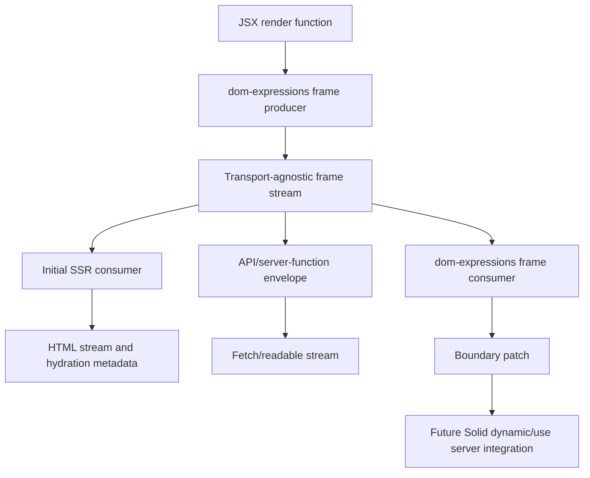

# RFC: dom-expressions Frame Streams

> **Canonical copy.** Moved here from the `frame-streams` spike repo
> (2026-07-14) so the design ships with the code it describes. The spike repo
> retains the proven standalone prototype, its perf harness, and the working
> HANDOFF; its copy of this RFC is frozen. Implementation status lives in the
> runtime: `packages/runtime/src/frame-sink.js` (producer),
> `packages/runtime/src/frame-client.js` (consumer), tests under
> `packages/runtime/test/ssr/frame-*.spec.js`.

## Summary

This RFC proposes a transport-agnostic **frame stream** primitive in
`dom-expressions`: a way to render JSX into a stream of structured chunks on the
server and apply those chunks to a live DOM boundary on the client, while
preserving client-owned content inside that boundary.

```ts
const stream = renderToFrameStream(() => <Page />);
consumeFrameStream(boundary, stream);
```

`consumeFrameStream` is a provisional harness/API name for discussing the
consumer. The eventual DOM integration may be `insert`-adjacent instead: a
branded private frame value that `insert` or an insert-owned reconciler can
recognize and apply. The first implementation can use an explicit consumer to
prove the model, but frame ownership, cleanup, and marker placement should be
designed so they can move into the normal DOM insertion path later.

Solid Server Components are the motivating consumer, but the first implementation
target is the native producer/consumer pair in `dom-expressions`, independent of
Solid authoring semantics, the compiler, and any network transport.

The first spike should be even narrower than the producer/consumer pair: a
standalone client-side frame mechanism using plain DOM boundaries and in-memory
records. It should prove that keyed frame-store writes, partial/streamed updates,
segment reveal readiness, stale-version discard, and a minimal server-owned DOM
morph path work before deciding whether the client frame runtime belongs in
`dom-expressions` core, above it as a separate package/framework layer, or only
needs small `dom-expressions` hooks. Slot reconciliation is not the first
full feature, but protected slot marker/range preservation should be
exercised early so the morph path does not choose an incompatible shape. It
should not integrate with `insert`, SSR production, serialization, or public APIs
yet.

The open question this RFC answers is **not** "what does Solid authoring look
like." It is: can `dom-expressions` produce and consume a native frame stream
that

- renders JSX into frame chunks (HTML, serialization records, assets,
  completion, errors) without the document/script envelope,
- applies those chunks to a boundary, ignoring stale versions, while
  preserving and rematching client-owned slot ranges, and
- folds the same logical stream into initial SSR, an API/server-function
  response, or a same-process test?

## Motivation

### The problem is post-load ownership drift, not rendering

After initial page load, client state diverges from what the server knows:
local signals, uncontrolled inputs, focus, owners, event handlers, optimistic
state, pending transitions, and component instances may all live inside a region
the server later wants to update.

Most hypermedia systems assume the server can safely re-own a target region:

```txt
server sends new HTML -> client morphs/replaces target
```

That fails for the server-components use case. The invariant we need is:

```txt
server-owned frame changes
client-owned slot ranges survive / rematch
```

This is why a frame is not an island, HTMX target, Datastar fragment, or a
generic morph target. Islands are server-rendered once and then client-owned.
Hypermedia can patch later but generally does not understand framework-owned
slot ranges. Server frames need **ownership-aware patching**.

### North-star scenario: HN comments with client-only collapse

A concrete success case is the Hacker News recursive comments demo:

- Story pages server-render recursive comments.
- A global client-only `collapsed` toggle in the header defaults to `false`.
- The toggle affects all current comments and comments on future client-side
  navigated story pages.
- Per-comment toggles can override the global setting.
- Collapse state must not be sent to the server on story requests.
- On a full story page load, comment content must appear no more than once across
  server HTML and serialized/script payloads.

This combines the missing quadrant:

```txt
Astro-like initial payload
+ RSC-like server/client composition
+ SPA-like persistent client state
+ streaming server updates
```

Existing approaches tend to miss one side: RSC/Qwik-style approaches preserve
client state but duplicate recursive content/data, Astro-style islands avoid
initial duplication but break under client-side navigation with persistent local
state, and hypermedia systems can morph server HTML but usually make the relevant
state server-visible or require bespoke client scripting.

### Grounding in existing primitives

`dom-expressions` already owns most of the substrate this needs:

- `packages/dom-expressions/src/server.js` has `renderToStream`,
  `sharedConfig.context.serialize`, streamed `registerFragment`, boundary asset
  tracking via `registerModule`, `serializeFragmentAssets`, and HTML marker
  replacement.
- `packages/dom-expressions/src/serializer.js` owns the Seroval setup and the
  `_$HY.r` keyed record model.
- `packages/dom-expressions/src/client.js` already hydrates keyed DOM, replays
  events, reads `_$HY.r`, and lazy-loads boundary assets.

So a frame stream is largely a **re-envelope of existing streaming machinery**,
not a new renderer. The novel work is on two seams: the server sink and the
client reconciler.

## Goals

- A native server **producer** (`renderToFrameStream`) that reuses the existing
  SSR renderer and streaming machinery but emits structured frame chunks instead
  of a document with inline `<script>` tasks.
- A native client **consumer** that applies chunks to a boundary, ignores stale
  versions, and preserves/rematches client-owned slot ranges. The explicit
  `consumeFrameStream` / `reconcileFrame` form is a test harness; the production
  form is `insert`-adjacent (see [Producer / Consumer API](#producer--consumer-api)).
- One logical `ServerFrameStream` that is **transport-agnostic**: folded into
  initial SSR, returned from an API/server-function endpoint, or consumed
  in-process without HTTP.
- A **shared serialization substrate** in `dom-expressions` so SSR and frame
  streams use one Seroval/chunk-framing configuration.

## Non-goals (for v1)

- Full React Flight compatibility.
- Solid authoring semantics (`"use server"`, `dynamic`) and compiler transforms.
- Network/closure serialization of server functions.
- Client-side slot slotting as the _first_ milestone (the format reserves
  room for it; see [Slot Model](#slot-model)).
- A renderer-neutral runtime. v1 is **DOM-only**. Renderer neutrality is
  aspirational and must not gate v1 (see [Renderer Neutrality](#renderer-neutrality)).

## First Spike

> **Status: implemented and extended well past the original spike** (this repo,
> `src/frame.ts`, `src/serializer.ts`, `src/producer.ts`). Covered:
>
> - resident keyed store, versioning as a stale-guard (policy A — a bump never
>   resets, so client state survives navigation), partial/streamed writes;
> - async segment reveal with readiness buffering, including inside nested
>   regions;
> - a zero-allocation, range-aware, slot-preserving reconciler (benchmarked
>   smallest and morphdom-class — see [Frame Reconciliation](#frame-reconciliation));
> - the full [client fill model](#the-client-fill-model-implemented): direct-insert
>   and render-function slots as one callback primitive, a data + server-content
>   args channel, wrapper-free marker-range server-content regions, multi-instance
>   callbacks (iteration), occurrence reorder (state-follows-id), re-call on args
>   change, and slot resolution threaded down the tree (no `use client` registry);
> - recursive server/client/server composition via a `FrameHost` with `id`-addressed
>   routing and out-of-order buffering — proven with an HN-shaped recursive-comments
>   test (iteration × recursion × client-only collapse preserved across a server
>   update);
> - a mock serializer (response-scoped, referential dedupe) standing in for Seroval,
>   template/block markup dedup, and frame lifecycle/disposal with cascading cleanup;
> - a server [producer spike](#producer--consumer-api) (`renderToFrameStream`) closing
>   the produce → host → client loop with generated (not hand-authored) chunks.
>
> No dependency on `dom-expressions`, Solid, Seroval, or the compiler. What
> remains: the SSR envelope + hydration handoff, real Seroval, `moveBefore` as a
> progressive enhancement for reorder focus, and the `dom-expressions` integration
> seam — the point at which the double-data question becomes measurable.

Before implementing `renderToFrameStream`, an insertable value protocol, or any
`dom-expressions` core integration, build a plain DOM proof of the frame
mechanism in a separate prototype repo/package. This is intentionally outside
`dom-expressions`: the spike must not depend on `dom-expressions`, Solid,
SolidStart, Seroval, the JSX compiler, or package internals.

```ts
const frame = createFrame(boundary);

frame.apply({
  version: 1,
  r: {
    "": { kind: "html", value: "<section>Hello<!--frame-fragment:p1--></section>" }
  }
});

frame.apply({
  version: 1,
  r: {
    "seg:p1": { kind: "html", value: "<p>Loaded later</p>" },
    "seg:p1:reveal": true
  }
});
```

This spike should test:

- root HTML application into a boundary
- keyed resident frame store writes
- repeated `apply(...)` calls that simulate streamed partial chunks
- segment content and reveal arriving separately
- readiness buffering when reveal arrives before content or placeholder
- stale-version discard
- minimal morph/patch for repeated server-owned frame updates
- protected slot marker/range preservation during morph, without full
  slot lifecycle callbacks yet
- early perf direction for replace vs morph vs segment reveal
- payload records shaped so later `html`, `block`, and `ops` modes remain possible

It should not test `insert`, SSR production, Seroval, network envelopes,
slot preservation, final package ownership, or any in-repo integration yet.
If the mechanism cannot be proven without importing `dom-expressions`, that is a
finding and the spike should fail rather than quietly leaning on runtime
internals.

The morph path should be intentionally narrow at first: text changes, attribute
changes, simple child insertion/removal, segment marker preservation, and
slot marker/range preservation. It is not the final slot-aware
reconciler: mount/move/dispose callbacks can wait. Its purpose is to decide early
whether the frame-store approach has a plausible performance path beyond
wholesale replacement without blocking later slot ownership.

## Producer / Consumer API

```ts
const stream = renderToFrameStream(() => factory(slotProps), options);
consumeFrameStream(boundary, stream);
```

- **Producer**: renders JSX into frame chunks — serialization records, assets,
  completion, and errors — without the normal document/script envelope. It
  renders HTML _fragments_, not full documents; uses local `noHydrate` frame
  ownership instead of a file-wide `hydratable: false` compile mode; reuses
  async/Suspense streaming, escaping, and asset tracking; and reports serialized
  records to a frame sink instead of flushing `<script>` tags.

- **Consumer**: accepts the chunk format, applies shell/segment/complete/error
  chunks to a boundary, ignores stale versions, and preserves/rematches
  slot ranges. The value inserted through DOM APIs can use a tight private
  brand because `dom-expressions` controls both ends.

- **Envelope adapters**: the same logical chunks are consumed with different
  envelopes — folded into initial SSR, returned from an API/server-function
  response, or consumed directly in same-process tests.

> **Producer spike (implemented, no JSX compiler).** A `renderToFrameStream`
> builder lets server code emit the wire `FrameChunk` sequence directly:
> `html`, `slot(key, args)`, `data(value) -> {$ref}` (response-scoped, deduped),
> `frame(render) -> {$frame}` for a nested server frame addressed by id, and
> `fragment`/`reveal` for async segments. Output is a plain, transport-agnostic
> chunk array; in-process tests feed it straight to a `FrameHost`. The full
> produce → host → client loop is proven with a recursive comment tree — the
> producer emits children before parents (exercising out-of-order buffering),
> the client's one `comment` callback renders the tree, and a repeated value
> dedupes to a single serialized ref across the stream. This validates the
> renderer/transport split before any real JSX-SSR sink extraction.

### Opt-in insertable / SSR value protocol

Frame streams should not make the core renderers always carry a large frame
runtime. The lower-level primitive can be a small, branded value protocol that
both client and server renderers recognize only when present.

Both renderers have room for this because unknown objects are not meaningful
render outputs today. A frame value can be an opt-in plugin object:

```ts
const $$INSERT = Symbol.for("dom-expressions.insertable");
const $$SSR = Symbol.for("dom-expressions.ssr");

type InsertableValue = {
  [$$INSERT]?: (parent: Node, marker: Node | null, current: unknown, options: unknown) => unknown;
  [$$SSR]?: (context: unknown) => unknown;
};
```

For the frame use case:

- Client `[ $$INSERT ]` establishes or reuses an insert range, subscribes to
  frame records, applies stale-version checks, patches/reconciles DOM, and
  cleans up with the owner.
- Server `[ $$SSR ]` renders the frame value through the current SSR context. It
  must be able to return or contribute normal SSR output, including structured
  `{ t, h, p }` results, so internal LoadingBoundaries/Suspense can participate
  in the parent document stream. It must not be limited to returning a final HTML
  string.

This keeps frame streams opt-in and tree-shakeable: applications that never
create branded frame values should not pay for the frame consumer/reconciler.
The brand check in hot paths should remain tiny; the heavy frame logic lives
behind imported plugin/value constructors.



### Boundary is an insert range

A frame boundary _is_ an `insert` range. `insert(parent, accessor, marker, …)`
already establishes the start/end markers, the resident `current` value, and the
owner-scoped cleanup (`cleanChildren`) that a frame needs. So "boundary id,"
"marker placement," and "frame cleanup" all resolve to one concrete thing — an
insert range — rather than a new lifecycle abstraction. The production consumer
should ride this path: a branded private frame value is recognized by `insert`
(or an insert-owned reconciler), which establishes the range and delegates to the
frame reconciler. The explicit `consumeFrameStream(boundary, stream)` form is the
test harness for proving the model before it moves into the insertion path.

### Push stream behind a pull-based insert

`insert` is pull-based: it runs inside an effect, takes an accessor, and
reconciles a single resident value. A frame stream is push-based — chunks arrive
asynchronously. These reconcile as follows:

- The branded frame value carries the stream subscription **and** the
  slot-aware reconciler, not a static snapshot.
- `insert` runs once to establish a stable range and owner, then delegates. It
  does **not** re-run per chunk; the owner is stable and the reconciler patches
  inside the range as writes land.
- Stale-version discard lives in the reconciler/store, not in `insert`. `insert`
  owns the range; the reconciler owns which chunks apply to it.

## Frame Stream Format

Define one logical, transport-agnostic `ServerFrameStream` consumed on both
sides. Chunks carry **explicit placement metadata** so the consumer interprets
them relative to a frame boundary/version rather than relying on global template
ids and inline scripts.

The schema should make existing implicit identities explicit: serialized data
ids, fragment ids, reveal groups, asset boundary ids, and (later) slot/slot
ids. Treat all of these as first-class structured record identities.

The first schema can be a readable object shape for tests; it must leave room for
a compact encoded form later **without changing the conceptual model**.

The format has two forms, and the distinction matters:

- **Wire form** — the `FrameChunk` sequence below. This is what crosses the
  transport envelope: discrete, ordered-ish messages.
- **Resident form** — a **key/value frame store**. This is the consumer's
  authoritative state. Chunks are _writes_ into a frame-scoped record table, not
  events to replay.

Implementation should bias toward the store model rather than an imperative
event-log mental model. Conceptually, applying chunks is incremental writes:

```ts
frame.r[""] = { kind: "html", value: "<section>...</section>" };
frame.r["seg:p1"] = { kind: "html", value: "<p>Loaded later</p>" };
frame.r["seg:p1:assets"] = { modules: {}, styles: [] };
frame.r["seg:p1:reveal"] = true;
```

This aligns with the existing Seroval / hydration shape (`id -> value`) and keeps
room for compact encodings or future `template` / `block` payload records. The
control-shaped chunks (`reveal`, `complete`, `error`) are **also writes**: they
set gate/flag keys in the store rather than firing transient events. The consumer
reveals a segment when both its content key and its `reveal` gate key are present,
which is why application is prerequisite-driven and order-independent by
construction (see [Chunk readiness and buffering](#chunk-readiness-and-buffering))
and why versioning is cheap (see [Versioning and stale chunks](#versioning-and-stale-chunks)):
a version bump allocates a fresh store and drops the old one, so writes to a dead
version have no live store to land in.

```ts
// Wire form: chunks mutate the resident store.
type FrameChunk =
  | { type: "start"; id: string; version: number }
  | { type: "html"; id: string; version: number; html: string }
  | { type: "data"; id: string; version: number; key: string; payload: string }
  | { type: "fragment"; id: string; version: number; key: string; parent?: string; html: string }
  | { type: "reveal"; id: string; version: number; keys: string[]; waitForStyles?: boolean }
  | {
      type: "assets";
      id: string;
      version: number;
      key: string;
      modules?: unknown;
      styles?: string[];
    }
  | {
      type: "slot";
      id: string;
      version: number;
      index: number;
      prop: string;
      kind: "jsx" | "render";
      args?: string;
    }
  | { type: "complete"; id: string; version: number }
  | { type: "error"; id: string; version: number; error: unknown };
```

The exact shape can change. The requirement is that each async chunk carries
enough location information for the consumer to place it relative to the active
frame, and that slot/slot chunks follow the same rule.

> **Implemented (spike).** The two forms are kept as distinct types with one
> translation point, which keeps the wire schema free to change without
> disturbing the store/reconciler:
>
> ```ts
> // Resident form: a batch of record writes the frame merges + flushes.
> interface FrameWrite {
>   version: number;
>   r: Record<string, unknown>;
> }
>
> // Wire form: the FrameChunk union above, addressed by id.
> // One mapping keeps them aligned:
> function chunkToRecords(chunk: FrameChunk): Record<string, unknown> {
>   //  html      -> r[""]              = { kind: "html", value }
>   //  fragment  -> r["seg:<key>"]     = { kind: "html", value }
>   //  reveal    -> r["seg:<key>:reveal"] = true  (per key)
>   //  data      -> r["data:<key>"]    = { kind: "data", payload }
>   //  assets    -> r["seg:<key>:assets"] = { modules, styles }
>   //  slot      -> r["slot:<index>"]  = { kind: "slot", prop, render, args }
>   //  complete  -> r[":complete"] = true;  error -> r[":error"] = error
> }
> ```
>
> A lone `Frame` consumes `FrameWrite` directly; a `FrameHost` consumes wire
> chunks, maps them through `chunkToRecords`, and routes them (see
> [Frame Host, Addressing, and Recursive Composition](#frame-host-addressing-and-recursive-composition)).
> `slot` records are carried but not yet acted on, and `complete`/`error`
> currently only set flag keys — the readiness model re-derives everything from
> the store each flush, so there is nothing to "replay."

### Two identity schemes

The format uses two deliberately distinct identity schemes:

- **String keys** for server-owned content — segments, data, assets
  (`seg:p1`, `data:user`, `seg:p1:assets`). The producer assigns these.
- **Positional index** for slots/slots (`index: 0`). Slots match by
  occurrence index to mirror unkeyed reconciliation (see
  [Slot Model](#slot-model)).

These coexist on purpose: server-owned records are keyed by the producer, while
client-owned slot ranges are positional so state follows position on update.

### Versioning and stale chunks

Every invocation carries a boundary `id` and a `version` (request id).
Slot indexes are stable within an invocation. When a newer invocation
starts, late chunks from older invocations must be ignored.

> **Implemented — version is a stale-guard, not a reset (policy A).** A version
> bump does **not** wipe the resident store or reset applied/reveal state; it
> only advances the current version so that writes tagged _older_ than it are
> discarded. Newer writes apply in place, so the reconciler morphs server
> content while client-owned slots/regions and their state survive — which is
> what makes a client-side navigation (a new version on a persistent frame)
> preserve local state, per the north-star invariant. An earlier design wiped
> the store on bump; that desynced the slot bookkeeping from the store and
> destroyed client state (a spurious empty re-call recreated the slot's DOM), so
> it was removed. A genuine teardown is `dispose()`, not a version bump. Two
> consequences to note: the store only grows across versions (stale server
> records linger but cannot apply without their structural prerequisites), and
> re-call still triggers on args-record _identity_, so a redundant resend of an
> unchanged slot chunk would cause one spurious re-call (a value/version check
> would remove that).

### Chunk readiness and buffering

There is no ordering policy. Because writes are keyed and idempotent into the
resident store, and application is gated on **semantic readiness**, chunk order is
irrelevant by construction — including the rare real-reorder case on a
multiplexed or retried API envelope. The only thing the consumer reasons about is
whether a write's prerequisites are present, not when it arrived.

This generalizes a gate `dom-expressions` already ships. Document SSR reveals an
async fragment only once its pending stylesheet count reaches zero: `$dfs(key,
count)` registers the count in `_$HY.sc`, `$dfc` decrements on load, and reveal
fires when the gate clears. Frame readiness is that same gate widened from
"styles only" to "all prerequisites."

**Readiness predicate.** A write for key `k` is ready to apply when:

- `frame.r[k]` is present (content has landed),
- the parent placeholder range for `k` exists (structural prerequisite),
- every declared dependency key on the write is present (e.g. a `reveal`'s
  `keys`), and
- gated external conditions are satisfied (e.g. `waitForStyles` ⇒ style count for
  `k` is zero).

The first three are structural/declared and checkable against the store; the last
mirrors the existing `_$HY.sc` style gate. The consumer buffers not-yet-ready
writes per `(id, version)` and re-evaluates them when a prerequisite lands. This
predicate is part of the format contract, not a transport detail left to callers.

**Idempotency and abort.** Two consequences of re-evaluation:

- Applying a buffered write must be idempotent or guarded. When a prerequisite
  finally lands and pending writes are re-evaluated, a `reveal` (or any write)
  must not double-apply.
- Buffered-but-never-ready writes need a drop path. Version bump already discards
  a whole stale invocation (see [Versioning and stale chunks](#versioning-and-stale-chunks)),
  but within the live version an `error` chunk or a segment that never resolves
  must clear its own pending writes so they cannot apply later.

### Payload modes

HTML string chunks are the **DOM v1 target** because they match current SSR
compiler output. The format must not foreclose richer payload modes:

```ts
frame.r[""] = { kind: "html", value: "<div>...</div>" };

frame.r["tpl:profile"] = {
  kind: "template",
  html: "<section><h1></h1><p></p></section>",
  fields: ["title", "description"]
};

frame.r["seg:profile"] = {
  kind: "block",
  template: "tpl:profile",
  values: ["Ada", "Profile text"]
};
```

- **html**: rendered HTML strings plus structured records. DOM v1.
- **template**: a static block once, then keyed values for dynamic positions;
  the client applies values to known DOM paths. More block-DOM-like; possibly
  enabled by static analysis of JSX templates.
- **block**: a keyed instance of a previously sent template.
- **ops**: renderer operations (create/set/insert/move); may help non-DOM
  renderers but needs different compiler output or HTML-to-op conversion.

## Frame Host, Addressing, and Recursive Composition

A single response streams chunks for a whole tree of frames — a server frame
whose client slot hosts another server frame, and so on. Those chunks
arrive as one flat, `id`-addressed stream. A **frame host** owns the id → frame
registry and routes each chunk to its frame:

```ts
const host = createFrameHost();
createFrame(boundary, { id: "outer", host, slots: { children: /* ... */ } });
host.apply(chunk); // routed to the frame named by chunk.id
```

Two properties make recursion work without the client hand-wiring the tree:

- **Frames self-register** under their id, including nested frames created inside
  a parent's client slot. So the client component tree declares _where_ a nested
  frame lives; the server stream addresses it by id.
- **Buffering is readiness, one level up.** A chunk addressed to a frame that has
  not registered yet (because its parent has not rendered the slot that creates
  it) is buffered and delivered the instant that frame registers. This is the
  same prerequisite-driven model as [chunk readiness](#chunk-readiness-and-buffering)
  inside a frame, lifted to the frame tree: server stream order and client mount
  order are independent. Buffering keeps only the newest version's chunks, so a
  stale chunk can never land after a frame appears.

This was proven in the spike with a deliberately out-of-order stream: the nested
frame's chunk arrives _before_ the chunk that renders the slot creating it, and
the tree still materializes correctly, preserving client content across
independent updates addressed to any level.

### Frame lifecycle

Frames are disposable, and disposal cascades through the tree:

- `dispose()` runs the frame's slot cleanups, stops it accepting chunks, and
  unregisters it from the host (dropping any chunks still buffered for its id).
- Slots receive an `onCleanup` channel. A slot that created a nested frame
  disposes it when the slot's range is removed from the server template, so
  removing a slot tears down everything it owned.

This mirrors the intended `insert`-range ownership: establishing the range,
owner-scoped cleanup, and disposal all resolve to one lifecycle rather than a
separate frame-tree bookkeeping layer.

> **Implemented — boundary retention across unmounts.** Disposal is not
> amnesia. When the last frame under an id unregisters, the host stashes a
> snapshot of its store — taken before the dispose scrub, so slot records
> survive; an element boundary whose markup arrived as document HTML (an
> adopted t = 0 frame, store carrying no root record) snapshots its current
> interior as the root instead — and the next frame to register under that
> id seeds from the snapshot before draining any buffered chunks. This is
> what keeps frames coherent under a caching data layer: a call answered
> from cache produces no new stream, so a remounted boundary must be able
> to re-materialize what the call last showed rather than render blank; a
> newer stream (a stale-cache refetch, a buffered preload) then morphs over
> the re-materialized state through the ordinary version policy. The
> snapshot is consumed by the mount that seeds from it and re-stashed by
> that mount's own unregister, so the retained set is bounded by boundaries
> currently unmounted. The no-frame `unregister(id)` form is a purge and
> drops the retained snapshot too.

## Data vs. Control-flow Serialization

Frame streams split the existing stream into two conceptual layers:

- **Data serialization** — keep Seroval and its keyed record model. Promise /
  stream / complex value support stays in the serializer layer, unchanged.

- **Control-flow serialization** — replace _active_ document scripts with
  _passive_ records. Document SSR serializes control flow as inline JavaScript
  (`_$HY.r[id] = ...`, `$df(id)`, `$dfj(ids)`, `$dfs(id, ...)`, `$dfc(id)`)
  because the main bundle may not have loaded and content must be placed before
  hydration. Frame streams serialize control flow as passive structured records
  because the bundled client consumer drives application of chunks.

This is the key reason the frame consumer must **not** reuse or generalize the
existing `$HY` / `$df*` document helpers. Those helpers are optimized for
initial-SSR bootstrap size and must stay small and specialized. The bundled
frame consumer can afford richer data structures, stale-version checks, and
slot reconciliation.

## Streaming and SSR

Existing `renderToStream` already provides most of the non-frame machinery:

- `createSerializer({ onData })` produces serialized data tasks.
- `registerFragment` tracks async fragment promises and emits template payloads
  after shell flush.
- `emitTask` batches reveal/style tasks (currently written through `<script>`).
- `buffer.write(...)` is the shared HTML/task output path.
- `serializeFragmentAssets` and asset tracking produce per-boundary module/style
  records.

The frame renderer should reuse those pieces behind a **pluggable output sink**,
not a parallel renderer:

```ts
type FrameSink = {
  html(value: string): void;
  data(value: string): void;
  task(value: string): void;
  asset(value: unknown): void;
  end(): void;
};
```

For document SSR, the sink keeps writing HTML and wrapping data/tasks in
`<script>` tags. For frame responses, the sink emits structured chunks and
leaves the transport envelope to the caller.

The shared implementation lives on the **server**: scheduling, root-hole
resolution, Seroval callbacks, asset tracking, fragment registration, and
completion. The two clients intentionally **diverge**: document streaming keeps
tiny inline helpers; frame streaming uses normal bundled `dom-expressions`
client code.

During initial SSR, slot output may already be present in the HTML:

```html
<!--slot:1:start-->
<button>Click</button>
<!--slot:1:end-->
```

Hydration gathers that range as client-owned slot `1`. Later frame updates
move or preserve the hydrated range instead of remounting it. Because server
frames may live in the same files as normal hydratable JSX, this must use local
`noHydrate` semantics rather than a file-wide `hydratable: false` compile mode.

## Slot Model

In this RFC, "slot reconciliation" does **not** mean reconciling the
inside of a client slot. Slot internals remain owned by whatever
client code created them. The frame runtime's responsibility is only the boundary
contract:

- identify slot marker/range positions in server-owned HTML,
- match those ranges to existing client-owned slot ranges by occurrence index,
- preserve or move the projected range when surrounding server-owned DOM changes,
- create a placeholder for a slot that client code should mount later, and
- notify/dispose only at the range boundary when a slot disappears.

The frame reconciler must not diff inside a slot range.

### Slots and slots are one primitive

A **slot** (a hole a server template declares for client content) and a
**slot** (a client-owned range the reconciler protects and rematches) are
the same thing viewed from opposite ends — one range, `<!--slot:<key>:start-->
… <!--slot:<key>:end-->`. The server declares the hole; the client fills the
interior once; the reconciler thereafter treats it as an opaque protected range.
The spike confirmed this unification: the "slot" fill path and the "slot"
preserve/rematch path are the same marker range and the same reconciler rule,
not two mechanisms. Discovery of a frame's own slots is scoped so it never
descends into a range interior, which is exactly why nested frames' slots are
invisible to their parent and recursion stays clean.

### The client fill model (implemented)

The spike built out the full slot model. Its shape, and the reasons behind it:

**Two co-equal slot kinds, one primitive.** A slot is a client callback
`(props, ctx) => nodes`:

- **Direct-insert** — the server passes no props; the marker is just a position
  the client fills with its own content (`props` is empty).
- **Render function** — the server invokes it with args: _data_ (`props.name`)
  and _server-rendered content_ (`props.children`). The client renders around
  them.

The server chooses which by whether it emits a `slot` invocation chunk with
args. Both fill the same protected range.

**No `use client`; slots are threaded, not referenced.** Client callbacks are
not resolved through a global client-reference manifest. They are threaded down
the single tree: a frame's slot resolution walks its own slots, then its
ancestors'. A server-content region therefore inherits the callbacks the client
threaded in, so a client slot revealed _inside streamed region content_ is
filled by that inherited callback — no registry, no separate request. Client
slots are placeholders the client fills (during SSR or on the client),
symmetric to server components being placeholders the server fills; neither
sends data back to the server.

**A callback can be invoked many times (iteration).** `items.map(c =>
props.comment(c))` produces N positional occurrences of one callback. An
occurrence id is the marker key (`comment#0`), and the callback is resolved by
its _prop_ (the part before `#`). Each occurrence has its own args, its own
server-content region, and its own re-call lifecycle; discovery is range-driven
(find every occurrence, resolve its callback), so occurrences can appear
dynamically as content streams in.

**Two argument kinds cross the seam:**

- _data_ — serialized to a `{$ref}` and resolved on the client (see
  [Shared Serialization Substrate](#shared-serialization-substrate)).
- _server content_ — a nested reconciled region delivered as a **marker range**
  (no wrapper element). The client places it; server chunks addressed to that
  region reconcile into it in place. This is where the server/client/server
  recursion happens, and it keeps the server a single tree with no waterfall:
  the `children` arg is _already-rendered_ server content delivered proactively,
  not a request.

**Updates are re-call; server-content updates are not.** The frame models a data
update as re-calling the callback with new props (React re-renders; a reactive
adapter like Solid instead updates proxied props without re-running). A re-call
reuses the occurrence's cached server-content regions, so it delivers new props
without recreating or disposing those regions. Crucially, streamed updates to a
server-content region are addressed to _its_ frame and reconcile in place with
**no** re-call of any ancestor callback — the "reconcile at the insertion point
even while props stream" contract. Preserving per-callback client state across a
_data_ re-call is the adapter's job (Solid fine-grain / React hooks); the frame
preserves server regions and client-owned DOM ranges, not closure state.

> **Implemented — live slot props (`ctx.onUpdate`).** The "reactive adapter
> updates proxied props without re-running" path above is now a first-class
> contract. A binding registers `ctx.onUpdate(fn)` synchronously during its
> invocation (one updater per occurrence; last registration wins). When a
> re-sent record's args **change in value**, the frame re-resolves them
> (renaming/reusing cached regions) and pushes the props into the live binding
> instead of re-calling — the invocation's instance, its client state, and its
> DOM identity survive the change, and reactive reads over the changed args
> fire. A genuine re-call or unmount clears the registration. Consumers that
> never register keep the re-call behavior described above, so the opt-in
> degrades cleanly for adapters without fine-grained props.

### Identity

Use **slot occurrence index** as the base identity. A factory like:

```tsx
return props => (
  <div>
    {props.header}
    {props.children(data)}
    {props.children(otherData)}
  </div>
);
```

produces slot records equivalent to:

```ts
[
  { index: 0, prop: "header", kind: "jsx" },
  { index: 1, prop: "children", kind: "render", args: [data] },
  { index: 2, prop: "children", kind: "render", args: [otherData] }
];
```

On update, old slot `1` rematches new slot `1`. If server output
changes slot order, state follows position — consistent with Solid's
unkeyed behavior. An explicit keyed slot helper can be considered later but
must not be required for the base model.

> Because server-controlled reordering silently migrates client-owned state, the
> reconciler's first-class test cases must include a conditional/reordering
> slot, not only text/attribute patching.

> **Implemented.** The occurrence id in the marker _is_ the identity, so the id
> scheme the producer chooses selects the behavior: index-style ids
> (`comment#0`) with shifted args give positional (state-follows-position);
> stable ids give keyed (state-follows-id). The reorder case is covered — moving
> a marked range carries its client node identity and state to the new position
> with no re-call. The known cost: moving a range with plain `insertBefore`
> drops focus/selection inside it; only `moveBefore` avoids that, and it is not
> Baseline (see [`moveBefore` is a progressive enhancement](#movebefore-is-a-progressive-enhancement-not-a-dependency)).

### Render props are the explicit server-to-client channel

```tsx
return props => <div>{props.children(data)}</div>;
```

The server is explicitly sending `data` to a local slot. When the factory
calls `props.children(data)`, the protocol emits a slot record with
serialized `data` arguments. This makes server-to-client values visible at the
callsite. If a nested server frame depends on that value, that is a real
dependency; if the same inputs are available from route/search params or
context, query/preload APIs should hoist the server calls and run them in
parallel.

### Double data (server-frame-only)

Double-data deduplication is **part of what makes this worth pursuing**, but it
applies only to server-owned frames. Normal client components keep the
traditional SSR cost:

```txt
HTML for initial paint + serialized data for hydration/client execution
```

That stays out of scope. Server frames have a narrower opportunity:

- Data used only inside server-owned frame rendering becomes HTML and is **not**
  serialized.
- Data passed into client slots/render props **must** be serialized.
- Repeated slot args should be deduped through frame-store references.
- The hard case is data that is **both** rendered into server HTML **and** sent
  to a client slot.

Baseline behavior may accept duplication for the hard case, but the protocol
leaves room for better approaches:

```ts
frame.r["data:user"] = { kind: "data", payload: "/* seroval user */" };
frame.r["slot:0"] = {
  kind: "slot",
  prop: "children",
  args: [{ ref: "data:user" }]
};
```

Avoid HTML reversal as the primary strategy. HTML is a lossy representation of
typed data and must not become the source of truth for reconstructing slot
values.

### Slot usage tracking and the streaming-occlusion case

Getter-backed slot props let the server track usage:

```txt
slot prop getter read on server   -> server rendered it -> HTML is the representation -> skip serialization
slot prop getter not read         -> server did not render it -> serialize for client render
```

The representation is exclusive: a slot read during server render is
streamed as HTML and adopted by the client; a slot not read is serialized
and rendered on the client.

Streaming destabilizes the "not read" case only in specific **occluded** cases.
A slot may be unaccessed at shell flush but accessed later when an async
segment resumes:

```txt
shell render does not read slot
shell flushes
later LoadingBoundary segment reads slot
```

If the runtime serialized the slot at shell flush and later also streamed
rendered slot HTML, it would duplicate. This is rare. To preserve the
no-double-serialization invariant, this case needs an explicit, locked policy:

- Scope usage tracking to the segment being flushed.
- Once a representation is chosen for a slot in a segment, do not emit the
  other representation for that same slot instance.
- If a slot is serialized before the server can prove it will be read
  later, that decision is locked: later server renders must not also stream final
  slot markup for that instance; they emit a placeholder/marker and let the
  client-rendered slot own that slot.
- If a slot's server usage cannot be known before the relevant flush
  boundary, prefer CSR for that slot instance.

In short:

```txt
sync / known server read         -> stream HTML and adopt
known unread                     -> serialize and client render
async / uncertain before flush   -> serialize once, client render, suppress later server slot markup
```

This is a rare per-slot escape hatch, not a global CSR fallback.

> **Open risk.** This invariant is the main value over plain islands/hypermedia.
> Whether the "uncertain before flush" escape hatch is rare or common in real
> Solid Suspense usage is unproven. A design-only proof of this policy should
> precede committing to the full substrate, because if the escape hatch is
> common the no-double-serialize invariant is theoretical.

> **Proven (executable model, `src/double-data.ts`).** A flush-ordered policy
> engine with a guard that _throws on any double emission_ resolves a
> representation per slot; a passing run is a proof the no-double invariant
> holds for that scenario, across 200-slot mixed runs. The key refinement:
> a slot **forwarded** into a pending segment (the render can prove at
> shell flush that it is consumed later) is **deferred** — it streams HTML if
> read there, serializes if not, with no double and no occlusion. Only a
> **conditional** read (data-dependent, unknowable at shell flush) hits the
> escape hatch: serialize once at shell, suppress the later server HTML. So the
> escape hatch is confined to conditional-async slot reads, not "any read
> after flush." This bounds open question 2: its real-world frequency reduces to
> how often a slot is _conditionally_ (not statically) read inside an async
> segment — a narrow, characterizable case — rather than threatening the
> invariant broadly.

## Frame Reconciliation

The client reconciler is specialized for server frames, not a generic DOM morph.
Generic morphers (e.g. micromorph) infer identity from DOM shape, ids, keys, and
heuristics. Server frames have stronger invariants:

- Server-owned DOM can be patched or replaced.
- Client-owned slot ranges are explicit.
- Slot identity is positional/indexed by default.
- Hydration can gather slot ranges up front.
- The boundary scope is known.
- The runtime owns slot insertion, disposal, delegation, and owner
  lifetimes.

Target API:

```ts
reconcileFrame(boundary, nextFragment, {
  getSlot(index) {},
  mountSlot(index, marker) {},
  moveSlot(index, marker) {},
  unmountSlot(index) {}
});
```

The reconciler updates server text, elements, attributes, and child order while
skipping slot interiors. On a matching slot marker it moves or
preserves the existing projected range; on a disappearing slot it clears or
disposes through the owning runtime callback — without destroying unrelated
client owners, events, refs, or local state.

Use micromorph as a reference/benchmark, not the architecture. The reconciler can
be simpler and more correct than generic morphing because slot markers are
explicit, boundaries are scoped, and server-owned DOM is separate from
client-owned slot ranges.

### Correctness invariant: never detach a client-owned range

The controlling invariant is **not** "patch server DOM in place" — it is _"a
client-owned range is never removed from the tree."_ In-place patching is only
the means to that end. This matters because client state that is tied to DOM
_connectedness_ — focus, text selection, IME composition, media playback, CSS
transitions, `:focus-within`, popover/dialog state — is destroyed by any
detach/reinsert, whereas a node _property_ like `input.value` survives it. A
prototype measured this in Chromium:

| DOM operation on a focused input        | focus kept | `.value` kept |
| --------------------------------------- | ---------- | ------------- |
| `insertBefore` / `appendChild` (move)   | ✗          | ✓             |
| `remove()` + re-insert                  | ✗          | ✓             |
| `innerHTML` rebuild + reslot            | ✗          | ✓             |
| `moveBefore` (atomic move)              | ✓          | ✓             |
| patch siblings in place, node untouched | ✓          | ✓             |

Two consequences:

- **Rebuild-and-reslot is disqualified.** Rebuilding the server shell and
  re-inserting client ranges is cheaper than diffing (it skips the diff), but it
  detaches every client range and so loses focus/selection/media. It is the same
  category error as a full `innerHTML` replace, only subtler because `.value`
  survives and hides the loss. The reconciler must patch server-owned DOM in
  place _around_ immovable client anchors.
- **Pure insertion/removal of server siblings is safe.** Inserting or removing a
  server-owned sibling next to a client range does not detach the range, so the
  common "server text/markup churn around stable slots" case preserves
  client state for free. Only a genuine _reorder_ of a client range forces a
  move.

### `moveBefore` is a progressive enhancement, not a dependency

The reorder case is the one place a client range must physically move, and only
`moveBefore()` (atomic/state-preserving move) preserves focus across a move.
`moveBefore` is **not Baseline**: Chrome/Edge 133+ and Firefox 144+ support it,
but Safari has no implementation and no shipped timeline, and it has blocked
Baseline since late 2025. So v1 correctness must hold on plain
`insertBefore`/`removeChild`. This is a strong argument to keep **positional
slot identity** as the v1 default (the Nth range stays the Nth node, so no
client range is ever moved) and to treat any keyed-reorder helper as an opt-in
that documents its degradation and uses `moveBefore` only as a feature-detected
fast path, with a focus save/restore fallback (imperfect: recovers focus + caret,
not IME/media/animation) elsewhere.

### Why not a general-purpose morpher (morphdom / idiomorph / micromorph)

A prototype compared this reconciler against the popular general-purpose
morphers on identical inputs in Chromium (2000 server rows; the client-anchor
case interleaves 20 client `<input>`s inside slot ranges and the server
update carries _empty_ slot markers):

| library              | size (min+gz) | server diff (1 of 2000) | client-anchor case | client kept | focus |
| -------------------- | ------------- | ----------------------- | ------------------ | ----------- | ----- |
| **frame reconciler** | **1.25 KB**   | **2.4 ms**              | **2.7 ms**         | **20/20**   | **✓** |
| morphdom             | 2.16 KB       | 2.1 ms                  | 3.6 ms             | 0/20        | ✗     |
| micromorph           | 1.29 KB       | 5.5 ms                  | 8.5 ms             | 0/20        | ✗     |
| idiomorph            | 3.25 KB       | ~200 ms\*               | ~85 ms\*           | 0/20        | ✗     |

<small>\* idiomorph's id-set matching degrades badly on dense, id-less sibling
lists; id-annotated content fares far better. Not representative of all
workloads.</small>

The decisive column is correctness, not speed. Every general-purpose morpher
faithfully diffs the live DOM toward the server target — and because the frame
server update carries _empty_ slot markers (the client owns that DOM; the
server never re-sends it), each morpher **deletes the client-owned content and
blows away focus**. Making them correct requires per-node
`onBeforeNodeDiscarded` / `beforeNodeMorphed` callbacks that re-implement
slot-range protection — i.e. rebuilding this reconciler on top of theirs,
and still shipping their bytes. Meanwhile a purpose-built two-cursor reconciler
that treats slot ranges as opaque protected units is the smallest of the
set, is morphdom-class on raw server diffing, and is the fastest _and only
correct_ option on the slot-preserving case. Conclusion: do not adopt a
generic morpher; keep the specialized reconciler.

## Example Chunk Shapes

These are concrete target shapes for planning tests, not final API commitments.
They validate that common document-streaming concepts can be represented as
passive records.

### 1. Synchronous HTML frame

```ts
[
  { type: "start", id: "f0", version: 1 },
  { type: "html", id: "f0", version: 1, html: "<div>Hello</div>" },
  { type: "end", id: "f0", version: 1 }
];
```

### 2. HTML plus serialized data

Equivalent to `sharedConfig.context.serialize("user", value)`, without wrapping
Seroval output in `<script>`.

```ts
[
  { type: "start", id: "f1", version: 1 },
  { type: "html", id: "f1", version: 1, html: "<div><!-- user data reads elsewhere --></div>" },
  { type: "data", id: "f1", version: 1, key: "user", payload: "/* seroval output */" },
  { type: "end", id: "f1", version: 1 }
];
```

### 3. Async fragment

Document SSR currently emits a placeholder, then later a `<template id="...">`
plus `$df(...)`. A frame stream makes that placement explicit.

```ts
[
  { type: "start", id: "f2", version: 1 },
  {
    type: "html",
    id: "f2",
    version: 1,
    html: "<section><h1>Profile</h1><!--frame-fragment:p1--></section>"
  },
  { type: "fragment", id: "f2", version: 1, key: "p1", html: "<p>Loaded later</p>" },
  { type: "reveal", id: "f2", version: 1, keys: ["p1"] },
  { type: "end", id: "f2", version: 1 }
];
```

### 4. Fragment assets and styles

Equivalent to current boundary asset serialization and style-gated reveal, as
passive data.

```ts
[
  {
    type: "assets",
    id: "f3",
    version: 1,
    key: "p1",
    modules: { "/src/Profile.tsx": "/assets/Profile.js" },
    styles: ["/assets/Profile.css"]
  },
  { type: "fragment", id: "f3", version: 1, key: "p1", html: "<article>...</article>" },
  { type: "reveal", id: "f3", version: 1, keys: ["p1"], waitForStyles: true }
];
```

### 5. Reserved slot slot

Likely not in the first implementation; the format leaves room for it.

```ts
[
  { type: "html", id: "f4", version: 1, html: "<div>Server shell<!--frame-slot:0--></div>" },
  {
    type: "slot",
    id: "f4",
    version: 1,
    index: 0,
    prop: "children",
    kind: "render",
    args: "/* seroval payload for render prop args */"
  }
];
```

### 6. Stale version handling

```ts
[
  { type: "start", id: "f5", version: 1 },
  { type: "start", id: "f5", version: 2 },
  { type: "fragment", id: "f5", version: 1, key: "late", html: "<p>Old</p>" },
  { type: "html", id: "f5", version: 2, html: "<p>Current</p>" },
  { type: "end", id: "f5", version: 2 }
];
```

Expected: the `version: 1` fragment is discarded after `version: 2` starts.

## Shared Serialization Substrate

Move common Seroval setup into `dom-expressions`: the web plugin list,
disabled-feature policy, scoped serializer factories, JS/JSON stream serializers
if shared, length-prefixed chunk framing, and stream readers. Keep live
serializer instances request/render/frame-local, but centralize configuration and
chunking policy.

`dom-expressions` should be the source of truth because it already owns SSR
hydration serialization and is the source bundled into the `solid-js/web` facade.
Expose the substrate through that facade so SolidStart server functions and
dom-expressions SSR/frame streams share one substrate, without Start owning a
separate serialization stack.

> **Coordination note.** This is a multi-repo change:
> `dom-expressions` → `@solidjs/web` → SolidStart (whose
> `packages/start/src/fns/serialization.ts` is the duplicate to reconcile). The
> migration is coupled across repos and should be tracked as its own dependency,
> not assumed local.

## Renderer Neutrality

v1 is DOM-only. HTML string chunks are inherently DOM-shaped, so "renderer
neutral" is aspirational, not a v1 constraint. The format hedges via the `ops`
payload mode and renderer-neutral boundary operations, but the abstraction tax
(sentinel movement, HTML-to-op conversion) must not be paid before the DOM v1
spike stabilizes. A single abstract universal-renderer protocol test is enough to
keep the seam honest until then.

## Design Space and Alternatives

### Datastar

Datastar is a useful reference for server-driven updates. It separates:

- element/fragment patches (HTML plus placement/merge semantics),
- signal patches (structured state, often JSON Merge Patch),
- a streaming envelope (commonly SSE).

For frame streams this suggests:

```txt
patch elements -> HTML/fragment/frame records
patch signals  -> Seroval/data records
merge metadata -> placement/control records
```

But Datastar's selector/merge model is insufficient alone: dom-expressions must
preserve and rematch runtime-owned slot ranges, hydration ranges, owners,
and eventual `insert` semantics.

### Mikado / proxied DOM

Mikado is a reference for compiled template updates, DOM state caching,
recycle/keyed modes, and DOM-proxy performance. It raises the real payload
question captured in [Payload modes](#payload-modes): HTML frame stream vs.
template+data stream vs. DOM op stream. HTML chunks are the DOM v1 target;
`template` / `block` / `ops` stay open as later modes.

### Why not closure serialization (future Solid layer)

For the later Solid integration, do not model `use server` component factories as
closure serialization. Captured server state is consumed while rendering the
frame on the server. The wire format carries frame chunks, rendered HTML or
renderer operations, slot markers, and explicit slot arguments. The
client receives a **proxy component**, not the returned server closure.

## Layered Ownership

Ownership of the client frame runtime is intentionally undecided until the first
standalone spike proves the mechanism. There are three plausible outcomes:

- The frame runtime belongs in `dom-expressions` because slot/hydration
  ownership forces it down into the DOM renderer.
- The frame runtime belongs above `dom-expressions` as a separate package or
  framework layer, with `dom-expressions` only providing small hooks.
- The mechanism remains experimental, and only the minimal hooks it reveals are
  added to `dom-expressions`.

- **`dom-expressions` server**: DOM SSR frame rendering — JSX-to-HTML fragments,
  escaping, async frame chunks, slot marker emission, local `noHydrate`
  ownership, asset/module tracking, `registerFragment`-style streaming. Exposes
  frame output independent of transport envelope.
- **`dom-expressions` client**: DOM frame reconciliation — parsing/materializing
  server HTML, diffing server-owned nodes, preserving/rematching slot
  ranges, coordinating with hydration/event/insert semantics.
- **SolidStart / server functions** (later): `"use server"` transformation,
  routing, preload/query integration, transport envelopes, cache keys,
  invalidation, deployment.
- **Solid runtime** (later): `dynamic`, async memo/component semantics,
  owner/disposal, execution of local slots/render props.
- **Future renderer adapters**: renderer-native frame materialization and
  sentinel/slot movement once the protocol is stable.

## Proposed Resolution

Adopt a native `dom-expressions` frame stream:

- One transport-agnostic `ServerFrameStream` with explicit per-chunk placement,
  boundary `id`, and `version`.
- A producer built as a **sink refactor** of `renderToStream`, not a parallel
  renderer.
- A bundled client consumer separate from the document `$df*` helpers, with
  passive control-flow records.
- A shared Seroval/chunk-framing substrate centralized in `dom-expressions` and
  exposed via `solid-js/web`.
- HTML payload chunks as the DOM v1 target, with `template` / `block` / `ops` and
  slot/slot records reserved as extension points.

Defer client-side slot slotting, double-data dedup, the Solid integration
layer, compiler boundary analysis, and non-DOM renderers — but reserve schema
space for each.

## Open Questions

1. Is positional slot identity sufficient, or is a keyed slot helper
   needed in v1 for common reordering cases? _Partly resolved:_ the occurrence id
   in the marker is the identity, so both are supported by the id scheme the
   producer chooses (index-style ids + shifted args = positional; stable ids =
   keyed) with no extra mechanism. The open part is the correctness stakes of the
   keyed path: positional identity never moves a client range (focus/selection/
   media preserved everywhere), while a keyed reorder physically moves a range and
   loses that state wherever `moveBefore` is unavailable (see open question 7).
   Which should be the default authoring model remains open.
2. Is the "uncertain before flush" slot escape hatch rare in real Solid
   Suspense usage, or common enough to undermine the no-double-serialize
   invariant? _Bounded by proof:_ an executable policy model
   (`src/double-data.ts`) shows the no-double invariant holds and that the escape
   hatch is confined to _conditional_ async reads — a slot statically
   forwarded into a pending segment defers cleanly (HTML or serialize) with no
   occlusion. So the question reduces to the frequency of conditional (not
   statically forwarded) slot reads inside async segments, which needs real
   Solid Suspense usage to measure but is a much narrower target than "any read
   after flush."
3. Can a clean `FrameSink` seam actually be extracted from the current
   `renderToStream`, or does the document entanglement force a near-parallel
   renderer?
4. Is the readiness predicate complete as stated (content + parent range +
   declared deps + style gate), or do nested/async segments need additional
   structural prerequisites?
5. Should the first frame payload commit to HTML chunks only, or carry a
   `template`/`block` mode early to validate the dedupe story sooner?
6. Where should the shared serialization substrate's public surface live on the
   `solid-js/web` facade, and what is the SolidStart migration path?
7. For the keyed-reorder case where a client range must physically move, what is
   the acceptable behavior on engines without `moveBefore` (currently Safari)? Is
   a focus + selection save/restore fallback sufficient, or should keyed reorder
   simply be unsupported until `moveBefore` reaches Baseline?

## Non-goals (restated)

- No React Flight compatibility in v1.
- No Solid authoring/compiler transforms in v1.
- No closure serialization of server functions.
- No general-purpose DOM morphing library.
- No renderer-neutral runtime promise gating DOM v1.
